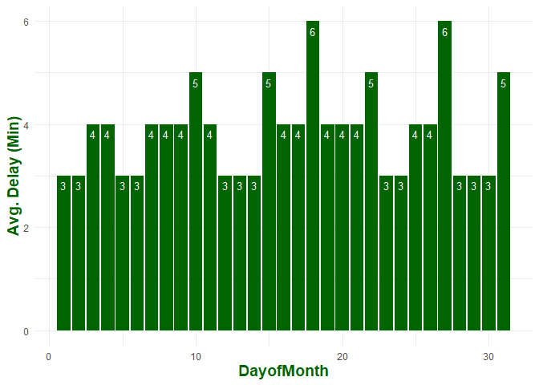

# Flights at ABIA

``` r
library(ggplot2)
library(dplyr)
```

    ## 
    ## Attaching package: 'dplyr'

    ## The following objects are masked from 'package:stats':
    ## 
    ##     filter, lag

    ## The following objects are masked from 'package:base':
    ## 
    ##     intersect, setdiff, setequal, union

``` r
library(gridExtra)
```

    ## 
    ## Attaching package: 'gridExtra'

    ## The following object is masked from 'package:dplyr':
    ## 
    ##     combine

``` r
df = read.csv("ABIA.csv")

#replace NAs with 0
df[is.na(df)] = 0

###  New Variable that accounts for ALL delays for a given flight
df$AVG_Delay = (df$ArrDelay + 
                  df$DepDelay + 
                  df$CarrierDelay + 
                  df$WeatherDelay + 
                  df$NASDelay + 
                  df$SecurityDelay + 
                  df$LateAircraftDelay)/7

### Description of delays in minutes
# ArrDelay arrival delay, in minutes
# DepDelay departure delay, in minutes
# CarrierDelay in minutes
# WeatherDelay in minutes
# NASDelay in minutes
# SecurityDelay in minutes
# LateAircraftDelay in minutes
```

## Time Series

A key component when traveling via flight surrounds *time delays*. In
fact a standard rule of thumbs is to arrive at an airport approximately
two hours prior to one’s flight departure. The two key figures part of
our assignment analyze the time delays surrounding time of year and time
of day for any given flight to/out of Austin-Bergstrom International
Airport. These two figures are made to provide insight on minimizing
delays when booking flights or on the day of flight.

### 1) When is the worst of time of the year for experiencing delays when flying to/out of Austin-Bergstrom International Airport?

``` r
#Calculate the average delay per year
Monthly = df %>%
  group_by(Month) %>%
  summarise_at(vars(AVG_Delay), list(name = mean))

#round values
Monthly$name = round( Monthly$name, 2)

#plot by month
ggplot(data=Monthly, aes(x=Month, y=name)) +
  geom_bar(stat="identity", fill="steelblue") +
  geom_text(aes(label=name), vjust=1.6, color="white", size=3.5) +
  theme_minimal() + 
  ylab("Avg. Delay (Min)") +
  theme( axis.title.y = element_text(color="steelblue", size=14, face="bold"),
         axis.title.x = element_text(color="steelblue", size=14, face="bold"))+
  scale_x_discrete(limits=c('Jan','Feb','Mar','Apr','May','Jun','Jul','Aug','Sep','Oct','Nov','Dec') )
```


#### 1) Interpretation

The graph above depicts the average delay time by month for 2008. From
the graph one can see that the highest delays occurred during the months
of December, March, and June. The lowest delays occurred during the
months of September, October, and November. It is understandable that
the month of December experiences delays as there are several holidays
that fall during the month and one can expect weather delays. March and
June are months when students/adults take Spring and Summer break
respectively, so the amount of delays are expected to be longer due to
overall volume of travelers. The months that experience the least amount
of time delays was surprising as the delays were almost a third of
overall delays experienced in other months.

### 2) When is the worst day of the week for experiencing delays when flying to/out of Austin-Bergstrom International Airport?

``` r
#Calculate the average delay per week day
Daily = df %>%
  group_by(DayOfWeek) %>%
  summarise_at(vars(AVG_Delay), list(name = mean))

#round values
Daily$name = round( Daily$name, 2) 

# plot by week day
ggplot(data=Daily, aes(x=DayOfWeek, y=name)) +
  geom_bar(stat="identity", fill="darkred") +
  geom_text(aes(label=name), vjust=1.6, color="white", size=3.5)+
  theme_minimal()+ 
  ylab("Avg. Delay (Min)") +
  theme( axis.title.y = element_text(color="darkred", size=14, face="bold"),
         axis.title.x = element_text(color="darkred", size=14, face="bold"))+
  scale_x_discrete(limits=c('M', 'T', 'W', 'TR', 'F', 'SA', 'SU') )
```


#### 2) Interpretation

The graph above depicts the average delay time by week day for 2008.
From the graph one can see that the highest delays occurred Friday and
Sunday. The lowest delays occurred during Wednesday and Saturday. Friday
marks the end of a business week while Sunday marks the end to a full
week, so it is understandable as to why there are longer delays on these
days. Wednesday can be expected to be slow as it is the middle of a
work-week and most people are stationary through the intra-week. One may
find it interesting that Saturday was the second day of the week that
experiences the least amount of time delays as it is not a work/business
day. One interpretation could be that most individuals traveling are
already at their destination by Friday or Sunday.

### 3) When is the worst of the month for experiencing delays when flying to/out of Austin-Bergstrom International Airport?

``` r
#Calculate the average delay per day of month
Weekly = df %>%
  group_by(DayofMonth) %>%
  summarise_at(vars(AVG_Delay), list(name = mean))

#round values
Weekly$name = round( Weekly$name, 0)

# plot by weekly
ggplot(data=Weekly, aes(x=DayofMonth, y=name)) +
  geom_bar(stat="identity", fill="darkgreen") +
  geom_text(aes(label=name), vjust=1.6, color="white", size=3.5)+
  theme_minimal()+ 
  ylab("Avg. Delay (Min)") +
  theme( axis.title.y = element_text(color="darkgreen", size=14, face="bold"),
         axis.title.x = element_text(color="darkgreen", size=14, face="bold"))
```



#### 3) Interpretation

The graph above depicts the average delay time by day of the month for
2008. From the graph one can see that the highest delays occurred in the
middle and towards the end of the month (day 10+). The lowest time
delays occurred during the beginning of the month (days \<10). One
interpretation could be that most working individuals reserve their
personal time off in case of emergency until the end of the month where
they then can utilize those unused PTO days for travel, thus affecting
volume/overall delays.

## Airline Carriers

We wanted to take this time series analysis to the next step by
potentially investigating delays in *Destinations* or *Carrier*. First
we decided which factor to analyze.

Destinations:

``` r
# now take a look at certain destinations / Carriers that may cause delays
table(df$Dest)
```

    ## 
    ##   ABQ   ATL   AUS   BNA   BOS   BWI   CLE   CLT   CVG   DAL   DEN   DFW   DSM 
    ##   435  2252 49637   792   368   730   380   659   653  5573  2673  5506     1 
    ##   DTW   ELP   EWR   FLL   HOU   HRL   IAD   IAH   IND   JAX   JFK   LAS   LAX 
    ##     1  1349   949   481  2319   367   670  3691   218   226  1358  1231  1733 
    ##   LBB   LGB   MAF   MCI   MCO   MDW   MEM   MSP   MSY   OAK   OKC   ONT   ORD 
    ##   692   245   470   459   632   712   834    55   444   236    88   305  2514 
    ##   ORF   PHL   PHX   RDU   SAN   SEA   SFO   SJC   SLC   SNA   STL   TPA   TUL 
    ##     1   290  2783   231   719   149   610   968   548   245    95   367    88 
    ##   TUS 
    ##   228

Carriers:

``` r
table(df$UniqueCarrier)
```

    ## 
    ##    9E    AA    B6    CO    DL    EV    F9    MQ    NW    OH    OO    UA    US 
    ##  2549 19995  4798  9230  2134   825  2132  2663   121  2986  4015  1866  1458 
    ##    WN    XE    YV 
    ## 34876  4618  4994

Based off intuition and value counts we moved further by analyzing the
main airline carriers:

-   value counts: there were too many unique values and more of a
    variation for flight destinations, while only a handful of airline
    carriers
-   intuition: the destination of flight is usually final (i.e. you are
    going to see your family in New York for the holidays), which
    airline carrier selected is less final (you have the option to
    choose the airline)

Our team personally researched the airline codes and selected what we
deemed as the most popular airlines and had the most flights out of
ABIA:

-   AA: American Airlines
-   DL: Delta Airlines
-   CO: Continental Airlines
-   WN: Southwest Airlines

``` r
#create new dataset
top = c('AA','DL','CO','WN')

Airlines = df[df$UniqueCarrier == top, ]

#### Description of delays in minutes
# ArrDelay arrival delay, in minutes
# DepDelay departure delay, in minutes
# CarrierDelay in minutes
# WeatherDelay in minutes
# LateAircraftDelay in minutes

#### Excluded the following as they are our of the airlines controls
# NASDelay in minutes
# SecurityDelay in minutes

# New Variable that accounts for multiple delays for a given flight
Airlines$Delay = (Airlines$ArrDelay + 
                    Airlines$DepDelay + 
                    Airlines$CarrierDelay + 
                    Airlines$WeatherDelay + 
                    Airlines$LateAircraftDelay)/5

# Calculate the average delay per year
X = Airlines %>%
  group_by(Month,UniqueCarrier ) %>%
  summarise_at(vars(Delay), list(name = mean))

#plot by month
X1 =ggplot(data=X, aes(fill= UniqueCarrier , x=Month, y=name)) +
  geom_bar(position = 'stack', stat="identity") +
  theme_minimal() +
  ylab("Avg. Delay (Min)") +
  theme( axis.title.y = element_text(color="black", size=14, face="bold"),
         axis.title.x = element_text(color="black", size=14, face="bold"))+
  scale_x_discrete(limits=c('Jan','Feb','Mar','Apr','May','Jun','Jul','Aug','Sep','Oct','Nov','Dec') )

X2 =ggplot(data=X, aes(fill= UniqueCarrier , x=Month, y=name)) +
  geom_bar(position = 'dodge', stat="identity") +
  theme_minimal() +
  ylab("Avg. Delay (Min)") +
  theme( axis.title.y = element_text(color="black", size=14, face="bold"),
         axis.title.x = element_text(color="black", size=14, face="bold"))+
  scale_x_discrete(limits=c('Jan','Feb','Mar','Apr','May','Jun','Jul','Aug','Sep','Oct','Nov','Dec') )

# Calculate the average delay per week day
Y = Airlines %>%
  group_by(DayOfWeek,UniqueCarrier ) %>%
  summarise_at(vars(Delay), list(name = mean))

# plot by week day
Y1 =ggplot(data=Y, aes(fill= UniqueCarrier , x=DayOfWeek, y=name)) +
  geom_bar(position = 'stack', stat="identity") +
  theme_minimal() +
  ylab("Avg. Delay (Min)") +
  theme( axis.title.y = element_text(color="black", size=14, face="bold"),
         axis.title.x = element_text(color="black", size=14, face="bold"))+
  scale_x_discrete(limits=c('M', 'T', 'W', 'TR', 'F', 'SA', 'SU') )

Y2 =ggplot(data=Y, aes(fill= UniqueCarrier , x=DayOfWeek, y=name)) +
  geom_bar(position = 'dodge', stat="identity") +
  theme_minimal() +
  ylab("Avg. Delay (Min)") +
  theme( axis.title.y = element_text(color="black", size=14, face="bold"),
         axis.title.x = element_text(color="black", size=14, face="bold"))+
  scale_x_discrete(limits=c('M', 'T', 'W', 'TR', 'F', 'SA', 'SU') )
```

``` r
grid.arrange(X1, Y1, nrow = 2)
```


``` r
grid.arrange(X2, Y2, nrow = 2)
```


### 4) Interpretation

The graphs above depict the average delay time by month & week-day for
2008 grouped by Airline Carrier. From the graphs one can see that the
highest time delays occurred on Delta Airlines…all that money for a
ticket and yet the longest delays! The shortest delays occurred on both
Southwest and American Airlines respectively. Continental airlines was
on the longer end of time delays, but not nearly as much as Delta.

## Conclusion

Overall based off of the 2008 ABIA flight data, we found that the best
time of the year to travel with shortest time delays is on the first or
second Saturday of September. Furthermore, we found that the best
Airline Carrier for the shortest time delay was Southwest Airlines.
