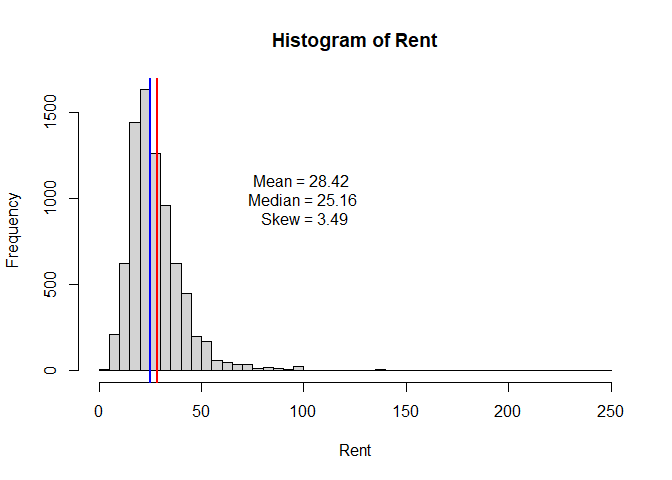
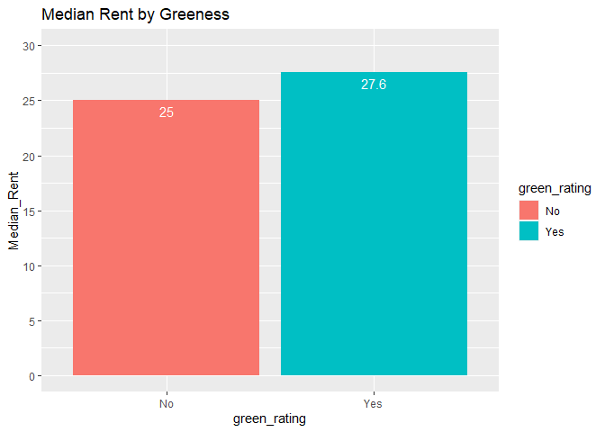
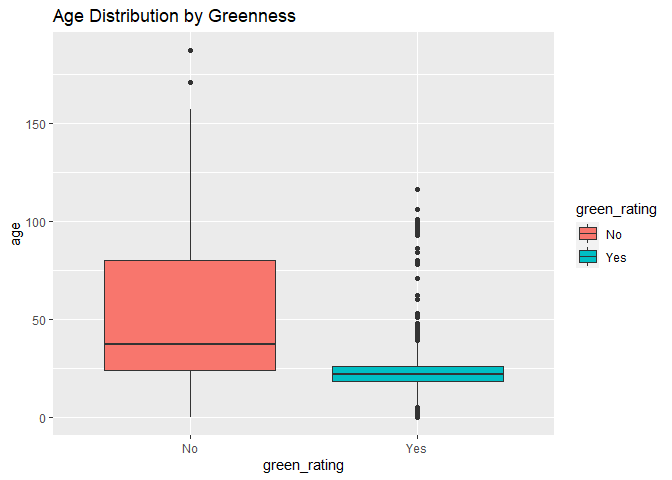
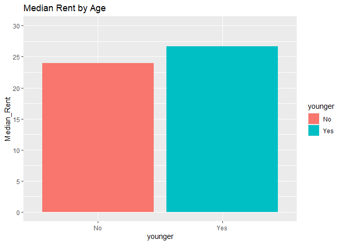
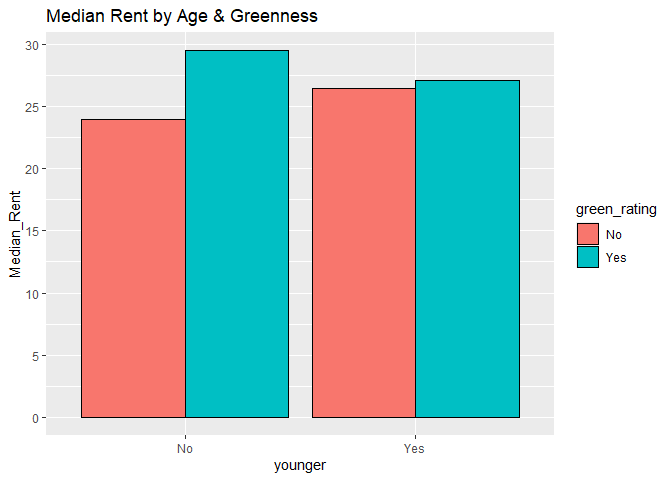
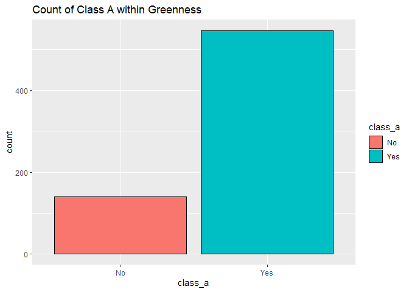
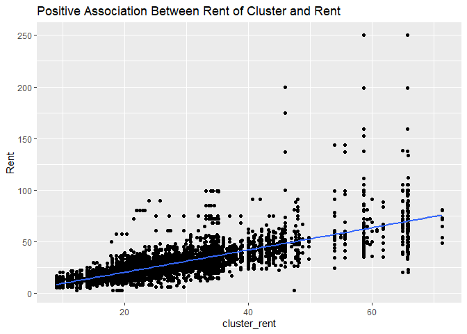
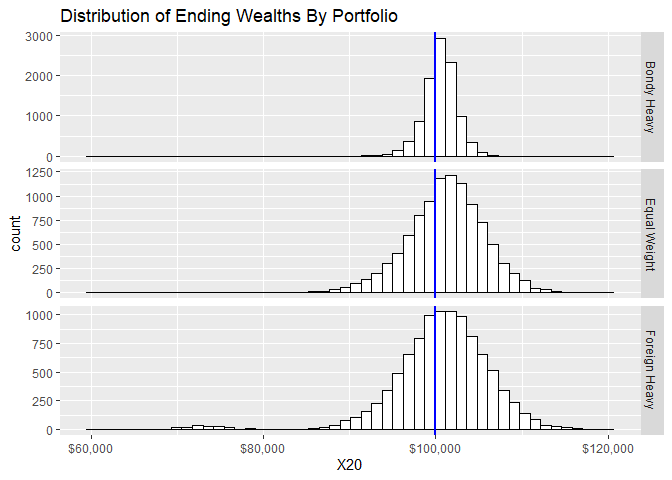
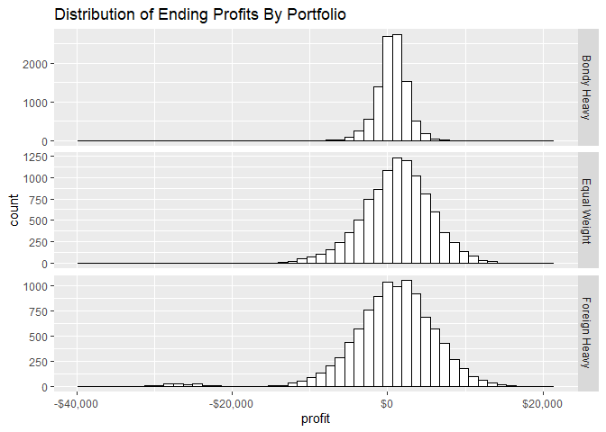

# Green Buildings

While the stats guru’s analysis provided a good baseline for thinking
about the issue, we believe his methodology fell short in several areas:
particularly when it comes to understanding the potential for
confounding variables.

After examining the data, we do not feel that there is sufficient
evidence, on a monetary basis, to justify the additional investment to
construct the building in line with green certification standards.

## Data Cleaning:

First, we can address the data cleaning aspect of the analysis. Are
there any adjustments that should be made to the raw data se? The excel
guru certainly felt that a certain amount of scrubbing should take
place. He decided that because some of the buildings had low occupancy
rates they should be excluded from the analysis due to their
“weirdness”. To explore the validity of this scrubbing we examined the
data points that the guru proposes we remove, we manually inspect these
observations and we do not find any other “weirdness” associated with
these points that would indicate they should be removed. There are 215
data points with leasing rates less than 10 or 2.7% of the original data
set. Without finding any reasonable justification, we decide not to
remove these observations as we feel our bias should be towards data
preservation.

## Mean vs Median: Who’s in Charge?

*Note: For the purposes of presentation clarity, we have converted all
categorical, binary variables from “1”, “0” to “Yes”,“No”.*

The guru decided to use the median, over the mean in his analysis and we
feel this approach is justified. Support for this position can be seen
in the below histogram which depicts the distribution of rents. The
rents are clearly right skewed, with a few points that lie far into the
right tail. The vertical, blue line indicates the median value, and the
vertical red line indicates the mean. We maintain that the appropriate
statistic for our purposes is the median, unless there is some
justification or reasoning that would indicate that this newly
constructed building will be out of the ordinary. From here on, we will
confine the majority of our analysis to looking at just the median.

## Big Picture: Green vs Non-Green

Now, as a starting point we can compare the median rent for green
buildings vs non-green buildings.

The median rent is certainly larger for green buildings vs non green
buildings: $27.60 per square foot for green buildings vs $25.00 for
non-green buildings. But this doesn’t really tell the full story. It is
too much a leap of faith to claim that this rental difference is due
solely to the building’s green rating. We need to dig deeper to
understand the data further and perhaps discover that the higher median
rent differential could be attributed to another variable.

## Confounders

We need to do some basic exploration of our data set beyond what we have
already done with a goal of understanding how a buildings green rating
is related to both rent and other variables. You might hypothesize that
green buildings are simply associated with other factors that are really
driving the difference in the median rental value. “Going Green” is a
newer phenomenon so we might expect that the majority of buildings that
have green certifications are newer buildings and that this newness is
what drives their rent higher. Perhaps buildings that are built with
green certification standard in mind are also built with higher quality
overall and that this higher quality, indicated by building class, is
what is determining rent dispersion. We must examine the data for the
possibility of these confounders.

To get a feel for the potential interactions between variables in the
data, we plot a correlation matrix.

There are lots of interesting relationships displayed here, but we would
like to focus on a few that provide interesting information to the
question at hand and test our hypothesized confounders: Age and Building
Class.

### Age

First, examining the distribution of Age by green and non-green
buildings, it’s clear that green buildings do tend to be younger.

We know that green buildings tend to be younger, but do younger
buildings command a rent premium? To uncover a potential relationship
here we create a new variable ‘younger’ that indicates if the building
is below the median age of all buildings in our data set. This will
allow us to control for the rent between young and old buildings:

We can see that younger buildings do have a higher median rent than
older buildings. This should cast some doubt on the case for the green
premium. We know green buildings tend to be younger and we know younger
buildings tend to have a higher rent. How can we untangle this!?

We’ll dig further by breaking down median rent by both green rating and
age:

    ## `summarise()` has grouped output by 'green_rating'. You can override using the `.groups` argument.

Interesting results. In both younger and older buildings, those that are
green have a higher median rent than those that are not green. This
lends a bit of credence to the green premium.

One intriguing point is that green buildings command a much higher
premium in older buildings. For our purposes of determining the premium
for the newly constructed building; however, the median rent
differential among younger buildings is more relevant. In this category
the premium is much smaller and we do not feel as confident in claiming
the premium is significant and not due to chance or other confounders.

### Class

What about class? We hypothesized that perhaps green buildings just
happen to be built of a higher quality and thus higher class. We can see
the evidence of this in the below plot. The majority of green buildings
are also class A buildings.

Now we show a breakdown similar to Age, that allows us to control for
being a class A building and examine the median of green vs non-green.

    ## `summarise()` has grouped output by 'green_rating'. You can override using the `.groups` argument.

Class A is the winner in terms of rent, which does not come as a large
surprise; we expect higher quality buildings to rent for more. There
does appear to be a small advantage within each category for green
buildings, but the dominant driver of rent here is the class.

## Neighbor Rent

We also decided to investigate the relationship between the rent of
other buildings in the local area with the rent of a particular
building. Our correlation matrix gave us a strong positive association
and we are always told that location is paramount when it comes to real
estate. Below, you can see the Cluster Rent, Rent pairs plotted along
with a fitted, single-predictor, regression line. The association
between local building rents and rent appears to be strong indeed
although the variance does increase as the cluster rent increases.

    ## `geom_smooth()` using formula 'y ~ x'

## Regression Model

As a final check on the analysis done so far, we run a multi-variable
regression model with all of our independent variables. Our primary goal
with this model is to validate and check the conclusions we have already
made and ground our analysis with some numerical precision. The summary
is depicted below:

    ## 
    ## Call:
    ## lm(formula = Rent ~ ., data = model_data)
    ## 
    ## Residuals:
    ##     Min      1Q  Median      3Q     Max 
    ## -53.869  -3.596  -0.531   2.497 174.533 
    ## 
    ## Coefficients:
    ##                     Estimate Std. Error t value Pr(>|t|)    
    ## (Intercept)       -7.716e+00  9.973e-01  -7.737 1.14e-14 ***
    ## size               6.686e-06  6.559e-07  10.193  < 2e-16 ***
    ## empl_gr            6.069e-02  1.693e-02   3.585 0.000340 ***
    ## leasing_rate       8.877e-03  5.320e-03   1.669 0.095196 .  
    ## stories           -3.622e-02  1.617e-02  -2.240 0.025149 *  
    ## age               -1.272e-02  4.713e-03  -2.698 0.006987 ** 
    ## renovated         -2.201e-01  2.566e-01  -0.858 0.390920    
    ## class_a            2.854e+00  4.379e-01   6.518 7.58e-11 ***
    ## class_b            1.179e+00  3.428e-01   3.439 0.000587 ***
    ## LEED               1.901e+00  3.584e+00   0.530 0.595837    
    ## Energystar        -4.444e-02  3.819e+00  -0.012 0.990715    
    ## green_rating       5.536e-01  3.840e+00   0.144 0.885375    
    ## net               -2.537e+00  5.931e-01  -4.278 1.91e-05 ***
    ## amenities          6.043e-01  2.504e-01   2.414 0.015809 *  
    ## cd_total_07       -1.266e-04  1.464e-04  -0.865 0.387164    
    ## hd_total07         5.369e-04  8.947e-05   6.002 2.04e-09 ***
    ## Precipitation      4.391e-02  1.598e-02   2.748 0.006014 ** 
    ## Gas_Costs         -3.444e+02  7.614e+01  -4.523 6.18e-06 ***
    ## Electricity_Costs  1.938e+02  2.489e+01   7.785 7.87e-15 ***
    ## cluster_rent       1.008e+00  1.402e-02  71.938  < 2e-16 ***
    ## ---
    ## Signif. codes:  0 '***' 0.001 '**' 0.01 '*' 0.05 '.' 0.1 ' ' 1
    ## 
    ## Residual standard error: 9.418 on 7800 degrees of freedom
    ##   (74 observations deleted due to missingness)
    ## Multiple R-squared:  0.6121, Adjusted R-squared:  0.6111 
    ## F-statistic: 647.7 on 19 and 7800 DF,  p-value: < 2.2e-16

Key takeaways from the model output. Age has a negative coefficient,
class_a has a positive coefficient, and cluster rent has a positive
coefficient. These match up with our previous analysis. Green Rating has
a slightly positive coefficient of .5, but it is not statistically
significant at the .05 level meaning that when we control for all of the
factors in the data, the positive impact of green rating does not
exhibit strong enough evidence that it truly exists. Another factor
worth considering is that that the Energy Star coefficient is actually
negative. This is interesting because if the developer does consider go
ahead with a green certification, they would need to decide if they
should get one or both certifications. Though it is not statistically
significant, we suggest they prioritize compliance with the LEED
standard.

## Conclusion

Our final recommendation is: based on the data currently available, we
do not recommend the developer should invest in the construction
necessary to achieve a green certification. The data does not provide
strong enough evidence to indicate that the green premium exists. The $
5 million dollars could be more appropriately invested elsewhere.

# Portfolio modeling

We are using 8 ETFs as a our feasible set for portfolio construction:

-   US Equities:
    -   ARK: ARK Innovation ETF.
    -   SDY: S&P 500 High Yield Dividend Aristocrats
    -   XLF: Diversified, financial equities
-   Fixed Income:
    -   GOT: US Treasuries
    -   HYG: US high yield, liquid, corporate bonds
-   Foreign Equities:
    -   EWJ: Large cap Japanese Stocks
    -   MCHI: Chinese Equity Market
-   Commodity
    -   BNO: Brent Crude Oil

## Portfolios

From the 8 ETFs listed, we defined three portfolios:

-   Equal Weight
    -   This portfolio holds all 8 ETFs in equal proportions.
-   Bond Heavy
    -   This portfolio consists allocates 40% to each of the two bond
        funds (GOT & HYG) and spreads the remaining 20% out equally
        among the remaining 6 ETFS.
-   Foreign Heavy
    -   This portfolio consists allocates 40% to each of the two non-US
        equity funds (EWJ & MCHI) and spreads the remaining 20% out
        equally among the remaining 6 ETFS.

The equal weight portfolio is chosen as it simply represents our default
approach. We do not have opinions on the future returns of the ETFs so
we would default to equal weighting all securities. We include the
foreign-heavy portfolio because we would like to understand how our
portfolio turns out if we decide to express the view that Chinese and
Japanese equities will outperform US Equities. Last, we expect that the
bond-heavy portfolio will be the safer choice, producing the lowest
losses, but providing the least returns. This ‘safe’ portfolio is
included because we want to understand the portfolio dynamics if we
decide to invest conservatively.

## Simulation

We perform a bootstrap simulation by randomly sampling the historical,
joint probability distribution of our 8 ETFs. The parameters of the
simulation are listed below:

| **Parameter**         | **Assumption** |
|-----------------------|----------------|
| Initial Capital       | $100,000       |
| Days Per Simulation   | 20             |
| Number of Simulations | 10,000         |

## Simulation Results

The results of the simulation are about in line with what you would
expect. The foreign-heavy portfolio appears to be the riskiest, while
offering the highest potential for return. The equal weight and
bond-heavy portfolios offer lower expected wealth, but provide less
variability in the potential outcome. We can now examine some plots and
summary statistics to better understand the portfolios

### Ending Wealth Distribution

As a first look, we examine the distribution of endings wealth by
portfolio. This gives us a quick and intuitive feel for what our
portfolios could look like at the end of the 20 day period. The blue
line below indicates the position of our starting wealth of $ 100,000.
This gives us a baseline to compare the rest of the results too by
highlighting the result if we did not invest in anything. In all three
portfolios there is a significant portion of the distribution to the
left of this line! If you are horrified by the idea of capital loss,
these investments may not be for you.

One additional point worth noting here is that the equal weight
portfolio appears to have a similar distribution to the foreign heavy
portfolio, except the equal weight portfolio does not suffer from the
extreme left tail possibilities as the foreign heavy does. This is
simply a consequence of effective diversification. The foreign heavy
portfolio is heavily allocated to the Chinese and Japanese markets. In
periods where those economies perform poorly, this portfolio will
perform poorly.

### Profits and Summary Statistics

After looking at the big picture, we can dive in further to get a more
complete understanding of our portfolios. First, we plot the
distribution of ending portfolio profits. These histograms are nearly
identical to the total ending wealth distributions we just looked at,
but these present the same information as a relative metric. Perhaps you
want to understand your expected dollar profit from each portfolio. You
can see this below:  

Next, we provide summary statistics for how the portfolios performed
across the simulations:

| Type          |  VAR\_.05 | Minimum_Profit | Max_Profit | Average_Profit |      MAD |     Range |
|:--------------|----------:|---------------:|-----------:|---------------:|---------:|----------:|
| Bondy Heavy   | -2,658.94 |      -8,213.04 |   8,455.31 |         560.80 | 1,637.10 | 16,668.35 |
| Equal Weight  | -6,476.81 |     -21,877.84 |  19,577.51 |       1,178.33 | 4,149.52 | 41,455.36 |
| Foreign Heavy | -8,005.90 |     -39,544.18 |  20,527.38 |         590.89 | 4,671.04 | 60,071.55 |

Summary Stats for Portfolio Profits

There is a lot of information to unpack from the table above.

-   VAR: The 5% value at risk for each portfolio tells us the amount we
    can expect to lose *at least* 5% of the time. This is helpful in
    understanding the risk associated with the left tail of our
    distribution. Even our safest investment, the bond portfolio will
    lose over $2,500 5% of the time! The VARs of both equal weight and
    foreign heavy take a big leap from the bond heavy portfolio, telling
    us that these portfolios have a much higher chance of turning out
    poorly.

-   Dispersion: The VAR is helpful information, but does not tell us the
    full story. For one thing, it ignores the worst case scenarios, but
    it also ignores all of the upside! We see the worst case scenarios
    through the minimum profit and get a feel for a best case scenario
    by looking at the max profit. Again, foreign-heavy portfolio does
    not look good. It gives us terrible worst case scenario, but a
    maximum profit that is not even as large a the equal weight. Last,
    the mean absolute deviation(MAD) tells us what the average deviation
    is from the mean. This is probably the best one number summary for
    understanding the risk of each portfolio.

-   Expected Profit: Our average profits tell us what our expected
    outcomes are. The interesting point here is that the foreign-heavy
    portfolio only has a marginally higher expected profit than the bond
    heavy portfolio and much less than the equal weight. That’s not a
    lot of compensation for all of the risk you are taking on!

The key takeaways are that the foreign-heavy portfolio is almost
certainly a bad idea. It provides little reward in the form of expected
returns to compensate us for potentially devastating worst case losses,
and higher variability. A more difficult decision is to make a
determination between the bond-heavy and equal weighted portfolios.

### Stress Testing: Worst Case Scenarios

As a final examination of the risk in each portfolio, we have selected
the worst performing periods for each portfolio and plotted out the path
of total wealth that occurred over the 20 day period. The idea here, is
to explore on an emotional level, how the worst case scenarios would
have felt in real time. It can be easy to look at summary statistics in
a calm setting and rationally explore which portfolio is best, but
actually living through bear markets is a different story all together.

Ouch! These would have been a pretty painful experiences for just a 20
day period. The foreign-heavy portfolio stands out again for its
remarkable ability to disappoint. This portfolio has a one day drop that
would have been difficult to stomach in real time. Losing such a
substantial portion of your wealth in a day would give even the thickest
skin investors pause.

## Concluding Thoughts

Choosing a portfolio is no simple endeavor. What portfolio is “correct”
can differ among people based on their particular circumstances. Time
horizon, liquidity needs, and risk tolerance are among three of the top
factors, but there can be many variables at play. What we can help to
do, is provide information that should help investors make the most
informed decision possible. In this particular case, we were able to
essentially eliminate the foreign-heavy portfolio from consideration
which will allow the investor to choose between the remaining
portfolios, based on which one more closely aligns with their personal
needs.

# Market Segmentation

The data we are analyzing was collected in the course of a
market-research study using followers of the Twitter account of a large
consumer brand called NutrientH20. Over the course of a seven-day
period, the follower’s tweet were categorized using 36 different
categories, each representing a broad area of interest.

## K-Means Clustering

To help NutrientH20 better understand its social-media audience, we used
k-means clustering to group its twitter followers into different
potential marketing segments. Prior to fitting the model, we removed the
following variables, as they would not provide any beneficial insight to
our problem: chatter, uncategorized, adult, and spam.

### Choosing the Number of Clusters

One of the difficulties in using K-Means Clustering is deciding how many
clusters to use. We decided to use the Elbow method which looks at the
total Within-Cluster Sum of Squares as a function of the number of
clusters; One should choose a number of clusters so that adding another
cluster doesn’t significantly improve the total WSS.

Looking at the elbow plot above, we’ll use 6 clusters for our analysis.

Another downside of K-means clustering is choosing the initial values,
or “seeds”, for the clusters. We use the K-means++ method to address
this issue. The clustering will show us what tweet topics are typically
posted together and help us form consumer personas for the marketing
department to target.

### Cluster 1

|               |    x |
|:--------------|-----:|
| sports_fandom | 5.90 |
| religion      | 5.26 |
| food          | 4.57 |
| parenting     | 4.06 |
| school        | 2.71 |
| photo_sharing | 2.63 |

Young Parents

**Young Parents:** With interests such as sports fandom, religion, food,
parenting, and school, this segment represents young parents. They will
want to provide their children with high quality water.

### Cluster 2

|                  |     x |
|:-----------------|------:|
| health_nutrition | 12.01 |
| personal_fitness |  6.45 |
| cooking          |  3.27 |
| outdoors         |  2.74 |
| photo_sharing    |  2.69 |
| food             |  2.13 |

Fitness Gurus

**Fitness Gurus:** With health nutrition and personal fitness the
predominant categories, this grouping represents the healthy and fit
archetype. They are likely to have a favorite water brand and stick to
it.

### Cluster 3

|                  |     x |
|:-----------------|------:|
| cooking          | 10.91 |
| photo_sharing    |  6.12 |
| fashion          |  5.53 |
| beauty           |  3.89 |
| health_nutrition |  2.28 |
| shopping         |  2.02 |

Millennial Influencers

**Millennial Influencers:** This segment is interested in cooking,
photo_sharing, fashion, and beauty and likely consists of social media
influencers. They like to share things with their network and would be
good marketers of NutrientH20.

### Cluster 4

|                  |     x |
|:-----------------|------:|
| college_uni      | 10.36 |
| online_gaming    |  9.25 |
| photo_sharing    |  2.87 |
| sports_playing   |  2.57 |
| tv_film          |  1.94 |
| health_nutrition |  1.73 |

College Student

**College Student:** This segment shows interest in college, online
gaming, photo sharing, and sports. This sounds like a typical college
student who likely isn’t too picky about what kind of water they drink.

### Cluster 5

|               |    x |
|:--------------|-----:|
| politics      | 8.93 |
| travel        | 5.61 |
| news          | 5.29 |
| photo_sharing | 2.54 |
| computers     | 2.47 |
| automotive    | 2.34 |

Traveling Businessman

    ##      politics        travel          news photo_sharing     computers 
    ##      8.933042      5.608443      5.294032      2.542940      2.474527 
    ##    automotive 
    ##      2.336245

**Traveling Businessman:** This segment has interests in politics,
travel, and news and represents the traveling businessman. They would be
a good group to target as they are frequently in airports and buying
water bottles.

### Cluster 6

|                  |    x |
|:-----------------|-----:|
| photo_sharing    | 2.28 |
| current_events   | 1.44 |
| shopping         | 1.28 |
| travel           | 1.10 |
| health_nutrition | 1.10 |
| politics         | 1.01 |

Average Consumer

**Average Consumer:** This cluster seems to be very balanced among
various categories and doesn’t provide too much information into a
specific archetype.

## Market Segments

1.  **Young Parents**
2.  **Fitness Gurus**
3.  **Millennial Influencers**
4.  **College Student**
5.  **Traveling Businessman**
6.  **Average Consumer**

NutrientH20 can target these market segments to improve their sales and
popularity!
