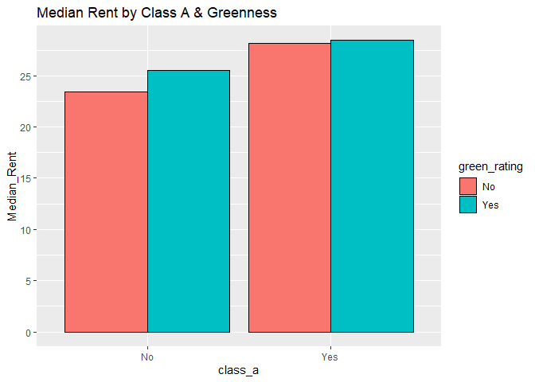
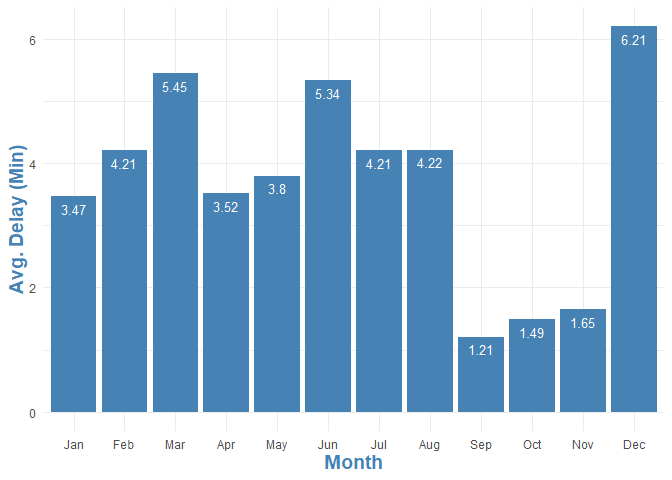
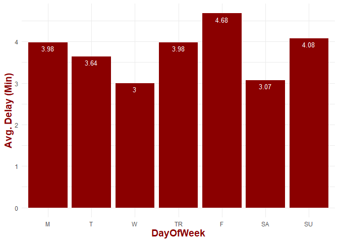
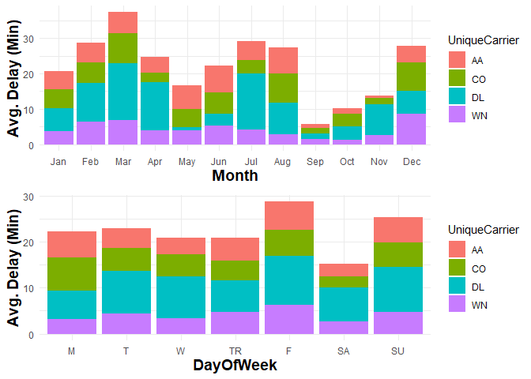
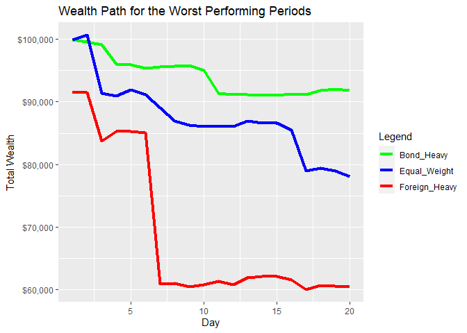
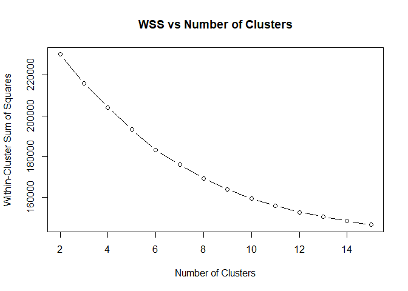
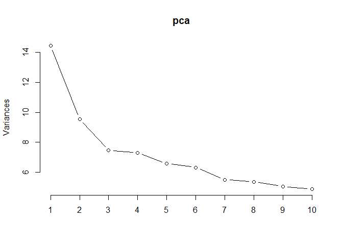
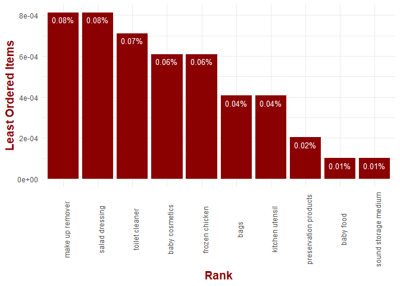

# STA 380, Part 2: Exercises

## Group Members: Aditya Soni, Brandt Green, Bret Jaco, Emilio Cabrera

### Link to Rmd File:

[Project_Rmd_File](https://github.com/Brandt-moreThan4/Machine-Learning/blob/main/STA%20380%20Part%202%20Exercises_Combined.Rmd)

   

# Green Buildings

While the stats guru’s analysis provided a good baseline for thinking
about the issue, we believe his methodology fell short in several areas,
particularly when it comes to understanding the potential for
confounding variables.

After examining the data, we do not feel that there is sufficient
evidence, on a monetary basis, to justify the additional investment
necessary to construct the building in line with green certification
standards.

## Data Cleaning

First, we can address the data cleaning aspect of the analysis. Are
there any adjustments that should be made to the raw data set? The excel
guru certainly felt that a certain amount of scrubbing should take
place. He decided that because some of the buildings had low occupancy
rates they should be excluded from the analysis due to their
“weirdness”. To explore the validity of this scrubbing we examined the
data points that the guru proposed be removed. We manually inspect these
observations and we do not find any other “weirdness” associated with
these points that would indicate they should be removed. There are 215
data points with leasing rates less than 10 or 2.7% of the original data
set. Without finding any reasonable justification, we decide not to
remove these observations as we feel our bias should be towards data
preservation.

## Mean vs Median: Who’s in Charge?

*Note: For the purposes of presentation clarity, we have converted all
categorical, binary variables from “1”, “0” to “Yes”,“No”.*

The guru decided to use the median, over the mean in his analysis and we
feel this approach is justified. Support for this position can be seen
in the below histogram which depicts the distribution of rents. The
rents are clearly right skewed, with a few points that lie far into the
right tail. The vertical, blue line indicates the median value, and the
vertical red line indicates the mean. We maintain that the appropriate
statistic for our purposes is the median, unless there is some
justification or reasoning that would indicate that this newly
constructed building will be out of the ordinary. From here on, we will
confine the majority of our analysis to looking at the median.

## Big Picture: Green vs Non-Green

Now, as a starting point we can compare the median rent for green
buildings vs non-green buildings, just as the guru did.

The median rent is certainly larger for green buildings vs non green
buildings: $27.60 per square foot for green buildings vs $25.00 for
non-green buildings. But this doesn’t really tell the full story. It is
too much a leap of faith to claim that this rental difference is due
solely to the building’s green rating. We need to dig deeper to
understand the data further and perhaps discover that the higher median
rent differential could be attributed to another variable or factor.

## Confounders

We need to do some basic exploration of our data set beyond what we have
already done with the goal of understanding how a building’s green
rating is related to both rent and other variables. One might
hypothesize that green buildings are simply associated with other
factors, which are really driving the difference in the median rental
value. “Going Green” is a newer phenomenon so we might expect that the
majority of buildings that have green certifications are newer buildings
and that this newness is what drives their rent higher. Perhaps
buildings that are built with green certification standard in mind are
also built with higher quality overall and that this higher quality,
indicated by building class, is what is truly determining rent
dispersion. We must examine the data for the possibility of these
confounders.

To get a feel for the potential interactions between variables in the
data, we plot a correlation matrix.

There are lots of interesting relationships displayed here, but we would
like to focus on a few that provide interesting information to the
question at hand and allow us to test our hypothesized confounders: Age
and Building Class.

### Age

First, examining the distribution of Age by green and non-green
buildings, it is clear that green buildings do tend to be younger.

We know that green buildings tend to be younger, but do younger
buildings command a rent premium? To uncover a potential relationship
here we create a new variable ‘younger’ that indicates if the building
is below the median age of all buildings in our data set. This will
allow us to analyze the rent between young and old buildings:

We can see that younger buildings do have a higher median rent than
older buildings. This should cast some doubt on the case for the green
premium. We know green buildings tend to be younger and we know younger
buildings tend to have a higher rent. How can we untangle this!?

We’ll dig further by breaking down median rent by both green rating and
age:

Interesting results. In both younger and older buildings, those that are
green have a higher median rent than those that are not green. This
lends a bit of credence to the green premium.

One intriguing point is that green buildings command a much higher
premium in older buildings. For our purposes of determining the premium
for the newly constructed building; however, the median rent
differential among younger buildings is more relevant. In this category
the premium is much smaller and we do not feel as confident in claiming
the premium is significant and not due to chance or other confounders.

### Class

What about class? We hypothesized that perhaps green buildings just
happen to be built of a higher quality and thus higher class. We can see
the evidence of this in the below plot. The majority of green buildings
are also class A buildings.

Now we show a breakdown similar to Age, that allows us to control for
being a class A building and examine the median rent of green vs
non-green.

Class A is the winner in terms of rent, which does not come as a large
surprise; we expect higher quality buildings to rent for more. There
does appear to be a small advantage within each category for green
buildings, but the dominant driver of rent here is the class.

## Neighbor Rent

We also decided to investigate the relationship between the rent of
other buildings in the local area with the rent of a particular
building. Our correlation matrix gave us a strong positive association
and we are always told that location is paramount when it comes to real
estate. Below, you can see the Cluster Rent, Rent pairs plotted along
with a fitted, single-predictor, regression line. The association
between local building rents and rent appears to be strong indeed
although the variance does increase as the cluster rent increases.

## Regression Model

As a final check on the analysis done so far, we run a multi-variable
regression model with all of our independent variables. Our primary goal
with this model is to validate and check the conclusions we have already
made and ground our analysis with some numerical precision. The summary
is depicted below:

    ## 
    ## Call:
    ## lm(formula = Rent ~ ., data = model_data)
    ## 
    ## Residuals:
    ##     Min      1Q  Median      3Q     Max 
    ## -53.869  -3.596  -0.531   2.497 174.533 
    ## 
    ## Coefficients:
    ##                     Estimate Std. Error t value Pr(>|t|)    
    ## (Intercept)       -7.716e+00  9.973e-01  -7.737 1.14e-14 ***
    ## size               6.686e-06  6.559e-07  10.193  < 2e-16 ***
    ## empl_gr            6.069e-02  1.693e-02   3.585 0.000340 ***
    ## leasing_rate       8.877e-03  5.320e-03   1.669 0.095196 .  
    ## stories           -3.622e-02  1.617e-02  -2.240 0.025149 *  
    ## age               -1.272e-02  4.713e-03  -2.698 0.006987 ** 
    ## renovated         -2.201e-01  2.566e-01  -0.858 0.390920    
    ## class_a            2.854e+00  4.379e-01   6.518 7.58e-11 ***
    ## class_b            1.179e+00  3.428e-01   3.439 0.000587 ***
    ## LEED               1.901e+00  3.584e+00   0.530 0.595837    
    ## Energystar        -4.444e-02  3.819e+00  -0.012 0.990715    
    ## green_rating       5.536e-01  3.840e+00   0.144 0.885375    
    ## net               -2.537e+00  5.931e-01  -4.278 1.91e-05 ***
    ## amenities          6.043e-01  2.504e-01   2.414 0.015809 *  
    ## cd_total_07       -1.266e-04  1.464e-04  -0.865 0.387164    
    ## hd_total07         5.369e-04  8.947e-05   6.002 2.04e-09 ***
    ## Precipitation      4.391e-02  1.598e-02   2.748 0.006014 ** 
    ## Gas_Costs         -3.444e+02  7.614e+01  -4.523 6.18e-06 ***
    ## Electricity_Costs  1.938e+02  2.489e+01   7.785 7.87e-15 ***
    ## cluster_rent       1.008e+00  1.402e-02  71.938  < 2e-16 ***
    ## ---
    ## Signif. codes:  0 '***' 0.001 '**' 0.01 '*' 0.05 '.' 0.1 ' ' 1
    ## 
    ## Residual standard error: 9.418 on 7800 degrees of freedom
    ##   (74 observations deleted due to missingness)
    ## Multiple R-squared:  0.6121, Adjusted R-squared:  0.6111 
    ## F-statistic: 647.7 on 19 and 7800 DF,  p-value: < 2.2e-16

Key takeaways from the model output. Age has a negative coefficient,
class_a has a positive coefficient, and cluster rent has a positive
coefficient. These match up with our previous analysis. Additionally,
green_rating has a slightly positive coefficient of .5, but it is not
statistically significant at the .05 level meaning that when we control
for all other factors in the data, the positive impact of green rating
does not exhibit strong enough evidence that it truly exists. Another
factor worth considering is that that the Energy Star coefficient is
actually negative. This is interesting because if the developer does
decide to pursue a green certification, they would need to decide if
they should get one or both certifications. Though it is not
statistically significant, we suggest they prioritize compliance with
the LEED standard.

## Conclusion

Our final recommendation is: based on the data currently available, we
do not recommend the developer should invest in the construction
necessary to achieve a green certification. The data does not provide
strong enough evidence to indicate that the green premium exists. The $5
million dollars could be more appropriately invested elsewhere.

         
 

# Flights at ABIA

## Time Series

A key component when traveling via flight surrounds **time delays**. Our
time series analysis is composed of annual, weekday and day of month
analyses for flight time delays to/out of Austin-Bergstrom International
Airport. The first plots are made to provide insight on minimizing
delays when booking flights across a given point in time. The second
figures are made to provide insight on minimizing time delays among the
top four airline carriers.

### 1) When is the worst of time of the year for experiencing delays when flying to/out of Austin-Bergstrom International Airport?

#### 1) Interpretation

The graph above depicts the average delay time by month for 2008. From
the graph one can see that the highest delays occurred during the months
of December, March, and June. The lowest delays occurred during the
months of September, October, and November. It is understandable that
the month of December experiences delays as there are several holidays
that fall during the month and one can expect weather delays. March and
June are months when students/adults take Spring and Summer break
respectively, so the amount of delays are expected to be longer due to
overall volume of travelers. The months that experience the least amount
of time delays was surprising as the delays were almost a third of
overall delays experienced in other months.

### 2) When is the worst day of the week for experiencing delays when flying to/out of Austin-Bergstrom International Airport?

#### 2) Interpretation

The graph above depicts the average delay time by week day for 2008.
From the graph one can see that the highest delays occurred Friday and
Sunday. The lowest delays occurred during Wednesday and Saturday. Friday
marks the end of a business week while Sunday marks the end to a full
week, so it is understandable as to why there are longer delays on these
days. Wednesday can be expected to be slow as it is the middle of a
work-week and most people are stationary through the intra-week. One may
find it interesting that Saturday was the second day of the week that
experiences the least amount of time delays as it is not a work/business
day. One interpretation could be that most individuals traveling are
already at their destination by Friday or Sunday.

### 3) When is the worst of the month for experiencing delays when flying to/out of Austin-Bergstrom International Airport?

#### 3) Interpretation

The graph above depicts the average delay time by day of the month for
2008. From the graph one can see that the highest delays occurred in the
middle and towards the end of the month (day 10+). The lowest time
delays occurred during the beginning of the month (days \<10). One
interpretation could be that most working individuals reserve their
personal time off in case of emergency until the end of the month where
they then can utilize those unused PTO days for travel, thus affecting
volume/overall delays.

### 4) Airline Carriers

We wanted to take this time series analysis to the next step by
potentially investigating delays in *Destinations* or *Carrier*. First
we decided which factor to analyze.

Destinations:

    ## 
    ##   ABQ   ATL   AUS   BNA   BOS   BWI   CLE   CLT   CVG   DAL   DEN   DFW   DSM 
    ##   435  2252 49637   792   368   730   380   659   653  5573  2673  5506     1 
    ##   DTW   ELP   EWR   FLL   HOU   HRL   IAD   IAH   IND   JAX   JFK   LAS   LAX 
    ##     1  1349   949   481  2319   367   670  3691   218   226  1358  1231  1733 
    ##   LBB   LGB   MAF   MCI   MCO   MDW   MEM   MSP   MSY   OAK   OKC   ONT   ORD 
    ##   692   245   470   459   632   712   834    55   444   236    88   305  2514 
    ##   ORF   PHL   PHX   RDU   SAN   SEA   SFO   SJC   SLC   SNA   STL   TPA   TUL 
    ##     1   290  2783   231   719   149   610   968   548   245    95   367    88 
    ##   TUS 
    ##   228

Carriers:

    ## 
    ##    9E    AA    B6    CO    DL    EV    F9    MQ    NW    OH    OO    UA    US 
    ##  2549 19995  4798  9230  2134   825  2132  2663   121  2986  4015  1866  1458 
    ##    WN    XE    YV 
    ## 34876  4618  4994

Based off intuition and value counts we moved further by analyzing the
main airline carriers:

-   value counts: there were too many unique values and more of a
    variation for flight destinations, while only a handful of airline
    carriers
-   intuition: the destination of flight is usually final (i.e. you are
    going to see your family in New York for the holidays), which
    airline carrier selected is less final (you have the option to
    choose the airline)

Our team personally researched the airline codes and selected what we
deemed as the most popular airlines and had the most flights out of
ABIA:

-   AA: American Airlines
-   DL: Delta Airlines
-   CO: Continental Airlines
-   WN: Southwest Airlines

### 4) Interpretation

The graphs above depict the average delay time by month & week-day for
2008 grouped by Airline Carrier. From the graphs one can see that the
highest time delays occurred on Delta Airlines…all that money for a
ticket and yet the longest delays! The shortest delays occurred on both
Southwest and American Airlines respectively. Continental airlines was
on the longer end of time delays, but not nearly as much as Delta.

## Conclusion

Overall based off of the 2008 ABIA flight data, we found that the best
time of the year to travel with shortest time delays is on the first or
second Saturday of September. Furthermore, we found that the best
Airline Carrier for the shortest time delay was Southwest Airlines.

         
 

# Portfolio modeling

We are using 8 ETFs as a our feasible set for portfolio construction:

-   US Equities:
    -   ARK: ARK Innovation ETF.
    -   SDY: S&P 500 High Yield Dividend Aristocrats
    -   XLF: Diversified, financial equities
-   Fixed Income:
    -   GOT: US Treasuries
    -   HYG: US high yield, liquid, corporate bonds
-   Foreign Equities:
    -   EWJ: Large cap Japanese Stocks
    -   MCHI: Chinese Equity Market
-   Commodity
    -   BNO: Brent Crude Oil

## Portfolios

From the 8 ETFs listed, we defined three portfolios:

-   Equal Weight
    -   This portfolio holds all 8 ETFs in equal proportions.
-   Bond Heavy
    -   This portfolio consists allocates 40% to each of the two bond
        funds (GOT & HYG) and spreads the remaining 20% out equally
        among the remaining 6 ETFS.
-   Foreign Heavy
    -   This portfolio consists allocates 40% to each of the two non-US
        equity funds (EWJ & MCHI) and spreads the remaining 20% out
        equally among the remaining 6 ETFS.

The equal weight portfolio is chosen as it simply represents our default
approach. We do not have opinions the future returns of the ETFs so we
would default to equal weighting all securities. We include the
foreign-heavy portfolio because we would like to understand how our
portfolio turns out if we decide to express the view that Chinese and
Japanese equities will outperform US Equities. Last, we expect that the
bond-heavy portfolio will be the safest choice, producing the lowest
losses, but providing the least returns. This ‘safe’ portfolio is
included because we want to understand the portfolio dynamics if we
decide to invest conservatively.

## Simulation

We perform a bootstrap simulation by randomly sampling the historical,
joint probability distribution of our 8 ETFs. The parameters of the
simulation are listed below:

| **Parameter**         | **Assumption** |
|-----------------------|----------------|
| Initial Capital       | $100,000       |
| Days Per Simulation   | 20             |
| Number of Simulations | 10,000         |

## Simulation Results

The results of the simulation are about in line with what you would
expect. The foreign-heavy portfolio appears to be the riskiest in terms
of variability and not offering much in terms of expected return to
compensate The bond-heavy portfolio offers lower expected wealth, but
provides less variability in the potential outcome. We can now examine
some plots and summary statistics to better understand the portfolios.

### Ending Wealth Distribution

As a first look, we examine the distribution of endings wealth by
portfolio. This gives us a quick and intuitive feel for what our
portfolios could look like at the end of the 20 day period. The blue
line below indicates the position of our starting wealth of $100,000.
This gives us a baseline to compare the rest of the results too by
highlighting the result if we did not invest in anything. In all three
portfolios there is a significant portion of the distribution to the
left of this line! If you are horrified by the idea of capital loss,
these investments may not be for you.

One additional point worth noting here is that the equal weight
portfolio appears to have a similar distribution to the foreign heavy
portfolio, except the equal weight portfolio does not suffer from the
extreme left tail possibilities as the foreign heavy portfolio does.
This is a direct consequence of effective diversification. The foreign
heavy portfolio is heavily allocated to the Chinese and Japanese
markets. In periods where those economies perform poorly, this portfolio
will perform poorly.

### Profits and Summary Statistics

After looking at the big picture, we can dive in further to get a more
complete understanding of our portfolios. First, we plot the
distribution of ending portfolio profits. These histograms are nearly
identical to the total ending wealth distributions we just looked at,
but these present the same information as a relative metric. Perhaps you
want to understand your expected dollar profit from each portfolio. You
can see this below:  

Next, we provide summary statistics for how the portfolios performed
across the simulations:

| Type          |  VAR\_.05 | Minimum_Profit | Max_Profit | Average_Profit |      MAD |     Range |
|:--------------|----------:|---------------:|-----------:|---------------:|---------:|----------:|
| Bondy Heavy   | -2,658.94 |      -8,213.04 |   8,455.31 |         560.80 | 1,637.10 | 16,668.35 |
| Equal Weight  | -6,476.81 |     -21,877.84 |  19,577.51 |       1,178.33 | 4,149.52 | 41,455.36 |
| Foreign Heavy | -8,005.90 |     -39,544.18 |  20,527.38 |         590.89 | 4,671.04 | 60,071.55 |

There is a lot of information to unpack from the table above.

-   VAR: The 5% value at risk for each portfolio tells us the amount we
    can expect to lose *at least* 5% of the time. This is helpful in
    understanding the risk associated with the left tail of our
    distribution. Even our safest investment, the bond portfolio will
    lose over $2,500 5% of the time! The VARs of both equal weight and
    foreign heavy take a big leap from the bond heavy portfolio, telling
    us that these portfolios will hurt much more when things turn out
    poorly.

-   Dispersion: The VAR is helpful information, but does not tell us the
    full story. For one thing, it ignores the worst case scenarios, but
    it also ignores all of the upside! We see the worst case scenarios
    through the minimum profit and get a feel for a best case scenario
    by looking at the max profit. Again, foreign-heavy portfolio does
    not look good. It gives us terrible worst case scenario, but a
    maximum profit that is about the same as the equal weight. Last, the
    mean absolute deviation(MAD) tells us what the average deviation is
    from the mean. This is probably the best one number summary for
    understanding the risk of each portfolio.

-   Expected Profit: Our average profits tell us what our expected
    outcomes are. The interesting point here is that the foreign-heavy
    portfolio only has a marginally higher expected profit than the bond
    heavy portfolio and much less than the equal weight. That’s not a
    lot of compensation for all of the risk you are taking on!

The key takeaway is that the foreign-heavy portfolio is almost certainly
a bad idea. It provides little reward in the form of expected returns to
compensate us for potentially devastating worst case losses, and higher
variability. A more difficult decision is making a determination between
the bond-heavy and equal weighted portfolios.

### Stress Testing: Worst Case Scenarios

As a final examination of the risk in each portfolio, we have selected
the worst performing periods for each portfolio and plotted out the path
of total wealth that occurred over the 20 day period. The idea here, is
to explore on an emotional level, how the worst case scenarios would
have felt in real time. It can be easy to look at summary statistics in
a calm setting and rationally explore which portfolio is best, but
actually living through bear markets is a different story all together.

Ouch! These would have been a pretty painful experiences for just a 20
day period. The foreign-heavy portfolio stands out again for its
remarkable ability to disappoint. This portfolio has a one day drop that
would have been difficult to stomach in real time. Losing such a
substantial portion of your wealth in a day would give even the thickest
skin investors pause.

## Concluding Thoughts

Choosing a portfolio is no simple endeavor. What portfolio is “correct”
can differ among people based on their particular circumstances. Time
horizon, liquidity needs, and risk tolerance are among three of the top
factors, but there can be many variables at play. What we can help with,
is provide information that should help investors make the most informed
decision possible. In this particular case, we were able to essentially
eliminate the foreign-heavy portfolio from consideration which will
allow the investor to choose between the remaining portfolios, based on
which one more closely aligns with their personal needs.

           

# Market Segmentation

The data we are analyzing was collected in the course of a
market-research study using followers of the Twitter account of a large
consumer brand called NutrientH20. Over the course of a seven-day
period, the follower’s tweet were categorized using 36 different
categories, each representing a broad area of interest.

## K-Means Clustering

To help NutrientH20 better understand its social-media audience, we used
k-means clustering to group its twitter followers into different
potential marketing segments. Prior to fitting the model, we removed the
following variables, as they would not provide any beneficial insight to
our problem: chatter, uncategorized, adult, and spam.

### Choosing the Number of Clusters

One of the difficulties in using K-Means Clustering is deciding how many
clusters to use. We decided to use the Elbow method which looks at the
total Within-Cluster Sum of Squares as a function of the number of
clusters; one should choose a number of clusters so that adding another
cluster doesn’t significantly improve the total WSS.

Looking at the elbow plot above, we’ll use 6 clusters for our analysis.

Another downside of K-means clustering is choosing the initial values,
or “seeds”, for the clusters. We use the K-means++ method to address
this issue. The clustering will show us what tweet topics are typically
posted together and help us form consumer personas for the marketing
department to target.

### Cluster 1

|               |    x |
|:--------------|-----:|
| sports_fandom | 5.90 |
| religion      | 5.26 |
| food          | 4.57 |
| parenting     | 4.06 |
| school        | 2.71 |
| photo_sharing | 2.63 |

**Young Parents:** With interests such as sports fandom, religion, food,
parenting, and school, this segment represents young parents. They will
want to provide their children with high quality water.

### Cluster 2

|                  |     x |
|:-----------------|------:|
| health_nutrition | 12.01 |
| personal_fitness |  6.45 |
| cooking          |  3.27 |
| outdoors         |  2.74 |
| photo_sharing    |  2.69 |
| food             |  2.13 |

**Fitness Gurus:** With health nutrition and personal fitness the
predominant categories, this grouping represents the healthy and fit
archetype. They are likely to have a favorite water brand and stick to
it.

### Cluster 3

|                  |     x |
|:-----------------|------:|
| cooking          | 10.91 |
| photo_sharing    |  6.12 |
| fashion          |  5.53 |
| beauty           |  3.89 |
| health_nutrition |  2.28 |
| shopping         |  2.02 |

**Millennial Influencers:** This segment is interested in cooking,
photo_sharing, fashion, and beauty and likely consists of social media
influencers. They like to share things with their network and would be
good marketers of NutrientH20.

### Cluster 4

|                  |     x |
|:-----------------|------:|
| college_uni      | 10.36 |
| online_gaming    |  9.25 |
| photo_sharing    |  2.87 |
| sports_playing   |  2.57 |
| tv_film          |  1.94 |
| health_nutrition |  1.73 |

**College Student:** This segment shows interest in college, online
gaming, photo sharing, and sports. This sounds like a typical college
student who likely isn’t too picky about what kind of water they drink.

### Cluster 5

|               |    x |
|:--------------|-----:|
| politics      | 8.93 |
| travel        | 5.61 |
| news          | 5.29 |
| photo_sharing | 2.54 |
| computers     | 2.47 |
| automotive    | 2.34 |

**Traveling Businessman:** This segment has interests in politics,
travel, and news and represents the traveling businessman. They would be
a good group to target as they are frequently in airports and buying
water bottles.

### Cluster 6

|                  |    x |
|:-----------------|-----:|
| photo_sharing    | 2.28 |
| current_events   | 1.44 |
| shopping         | 1.28 |
| travel           | 1.10 |
| health_nutrition | 1.10 |
| politics         | 1.01 |

**Average Consumer:** This cluster seems to be very balanced among
various categories and doesn’t provide too much information into a
specific archetype.

## Market Segments

1.  **Young Parents**
2.  **Fitness Gurus**
3.  **Millennial Influencers**
4.  **College Student**
5.  **Traveling Businessman**
6.  **Average Consumer**

NutrientH20 can target these market segments to improve their sales and
popularity!

           

# Author Attribution

## Loading libraries

Load libraries like tm, tidyverse, slam, proxy, etc.

## Defining functions and Reading the training data

The readPlain function is defined, which reads in the lines from a text
file. The content and authors of all text files (2500 files) are read-in
and the data is stored in a Corpus object.

## Training data - Pre-processing, removing the stop words, and Tokenization

For the content of training files, some cleaning and pre-processing is
done such as:

-   Converting all text to lowercase, removing all numbers, removing all
    punctuation, stripping extra white spaces, and removing the stop
    words.
-   A DTM(document-term matrix) is created where the words in the
    documents are the columns and each document is a row.
    Standardization of the DTM is done using TF-IDF.

<!-- -->

    ## <<DocumentTermMatrix (documents: 2500, terms: 32570)>>
    ## Non-/sparse entries: 537861/80887139
    ## Sparsity           : 99%
    ## Maximal term length: 40
    ## Weighting          : term frequency (tf)

    ## <<DocumentTermMatrix (documents: 10, terms: 20)>>
    ## Non-/sparse entries: 48/152
    ## Sparsity           : 76%
    ## Maximal term length: 11
    ## Weighting          : term frequency (tf)
    ## Sample             :
    ##     Terms
    ## Docs access accounts agencies also announced bogus business called character
    ##   1       1        1        1    1         1     2        2      1         4
    ##   10      4        0        0    1         0     0        1      0         4
    ##   2       0        0        0    2         1     0        1      0         4
    ##   3       2        0        0    0         0     0        0      0         4
    ##   4       0        0        0    0         1     0        1      0         4
    ##   5       0        0        0    0         1     0        1      0         4
    ##   6       0        0        0    0         0     0        0      0         4
    ##   7       0        0        1    1         0     0        0      1         4
    ##   8       0        0        0    0         0     0        1      0         4
    ##   9       0        0        1    0         0     0        1      0         4
    ##     Terms
    ## Docs charged
    ##   1        1
    ##   10       0
    ##   2        0
    ##   3        0
    ##   4        0
    ##   5        0
    ##   6        0
    ##   7        0
    ##   8        1
    ##   9        1

    ## <<DocumentTermMatrix (documents: 2500, terms: 801)>>
    ## Non-/sparse entries: 240686/1761814
    ## Sparsity           : 88%
    ## Maximal term length: 18
    ## Weighting          : term frequency - inverse document frequency (normalized) (tf-idf)

## Loading the Test Data

Similar to train data, the test data is read-in and stored as a corpus
object.

    ## <<SimpleCorpus>>
    ## Metadata:  corpus specific: 1, document level (indexed): 0
    ## Content:  documents: 2500

## Test data - Pre-processing, removing the stop words, and Tokenization

Similar to train data, cleaning and pre-processing of test data is done.

    ## <<SimpleCorpus>>
    ## Metadata:  corpus specific: 1, document level (indexed): 0
    ## Content:  documents: 2500

## Making sure that training and test sets have the same columns (words)

Since there are many additional words which don’t appear in the training
dataset but are present in test dataset, we decided to remove all those
words from the test dataset and only keep the ones common in both the
datasets.

    ## <<DocumentTermMatrix (documents: 2500, terms: 801)>>
    ## Non-/sparse entries: 241658/1760842
    ## Sparsity           : 88%
    ## Maximal term length: 18
    ## Weighting          : term frequency - inverse document frequency (normalized) (tf-idf)

## Principal Component Analysis - Reducing the dimensions

Since there are hundreds of words (variables) in the training and test
dataset, it is better to reduce the number of variables using principal
component analysis. 400 principal components explain almost 80% of the
variance. Thus, taking 400 PCs and building the models.

# Classification models

After preparing the train and test datasets, we can now start to build
classification models and test their accuracy on test dataset.

## KNN

Starting with KNN classification, we take K=10 and the accuracy we get
is 35.4%

    ## [1] 886

    ## [1] 35.44

## Naive Bayes

Using naive bayes model, we get an accuracy of 46.92%.

    ##           Length Class  Mode     
    ## apriori    50    table  numeric  
    ## tables    400    -none- list     
    ## levels     50    -none- character
    ## isnumeric 400    -none- logical  
    ## call        4    -none- call

    ## [1] 46.92

## Random Forest

With a random forest model, the accuracy obtained is 70.6%

    ## [1] 70.6

## Conclusion

Thus, 3 classification models are made and the most accurate model was
found to be Random Forest with an accuracy of 70.6%

           

# Association Rule Mining

## Reading the data

## Exploring transactions and items

    ## transactions as itemMatrix in sparse format with
    ##  9835 rows (elements/itemsets/transactions) and
    ##  169 columns (items) and a density of 0.02609146 
    ## 
    ## most frequent items:
    ##       whole milk other vegetables       rolls/buns             soda 
    ##             2513             1903             1809             1715 
    ##           yogurt          (Other) 
    ##             1372            34055 
    ## 
    ## element (itemset/transaction) length distribution:
    ## sizes
    ##    1    2    3    4    5    6    7    8    9   10   11   12   13   14   15   16 
    ## 2159 1643 1299 1005  855  645  545  438  350  246  182  117   78   77   55   46 
    ##   17   18   19   20   21   22   23   24   26   27   28   29   32 
    ##   29   14   14    9   11    4    6    1    1    1    1    3    1 
    ## 
    ##    Min. 1st Qu.  Median    Mean 3rd Qu.    Max. 
    ##   1.000   2.000   3.000   4.409   6.000  32.000 
    ## 
    ## includes extended item information - examples:
    ##             labels
    ## 1 abrasive cleaner
    ## 2 artif. sweetener
    ## 3   baby cosmetics

    ## [1] 9835  169

The overall structure of the data consisted of 9835 transactions across
169 items. 2159 transactions with 1 item, 1643 transactions with 2 items
and so on.

## Top 10 Popular & Unpopular Items

Based on the graphs above the two most common grocery items were whole
milk and vegetables while the not so common items were baby food and
storage product. From this analysis, there were two concerning items in
the top 10 purchased groceries list. Individuals frequently purchase
soda and shopping bags. Soda’s presence on the list was not a main
concern, the concern lies in the fact that it held a higher position
than water. Another insight is the frequent purchase of shopping bags,
as climate change is a growing issue, reusable bags should be the
standard alternative and promoted at all grocery stores.

## Building a Model

Deciding the Support- Since we have a lot of items, let’s select a
minimum support of 0.01 However, as we can see below, keeping a support
of 0.01 will remove almost half of the items. (Since the support works
on pair-wise criteria, the exact exclusions will be different but we can
still get a sense of the support value) Items with support greater than
threshold 0.01:

    ##    Mode   FALSE    TRUE 
    ## logical      81      88

Thus, we try with a support of 0.001 Here, we see that we are removing
12 least-ordered items from the analysis, which is acceptable. Items
with support greater than threshold 0.001:

    ##    Mode   FALSE    TRUE 
    ## logical      12     157

## Apriori model

Using a support of 0.001 and confidence of 0.50, i.e. the conditional
probability of A given B should be at least 50%. We chose
confidence=0.50 as there are so many items and orders, so its better to
start with a value somewhere in the middle. Result= We get 5668 rules-
11 rules with 2 items, 1461 rules with 3 items, 3211 rules with 4 items,
939 rules with 5 items and 46 rules with 6 items.

    ## Apriori
    ## 
    ## Parameter specification:
    ##  confidence minval smax arem  aval originalSupport maxtime support minlen
    ##         0.5    0.1    1 none FALSE            TRUE       5   0.001      1
    ##  maxlen target  ext
    ##      10  rules TRUE
    ## 
    ## Algorithmic control:
    ##  filter tree heap memopt load sort verbose
    ##     0.1 TRUE TRUE  FALSE TRUE    2    TRUE
    ## 
    ## Absolute minimum support count: 9 
    ## 
    ## set item appearances ...[0 item(s)] done [0.00s].
    ## set transactions ...[169 item(s), 9835 transaction(s)] done [0.01s].
    ## sorting and recoding items ... [157 item(s)] done [0.00s].
    ## creating transaction tree ... done [0.00s].
    ## checking subsets of size 1 2 3 4 5 6 done [0.02s].
    ## writing ... [5668 rule(s)] done [0.00s].
    ## creating S4 object  ... done [0.00s].

    ## set of 5668 rules
    ## 
    ## rule length distribution (lhs + rhs):sizes
    ##    2    3    4    5    6 
    ##   11 1461 3211  939   46 
    ## 
    ##    Min. 1st Qu.  Median    Mean 3rd Qu.    Max. 
    ##    2.00    3.00    4.00    3.92    4.00    6.00 
    ## 
    ## summary of quality measures:
    ##     support           confidence        coverage             lift       
    ##  Min.   :0.001017   Min.   :0.5000   Min.   :0.001017   Min.   : 1.957  
    ##  1st Qu.:0.001118   1st Qu.:0.5455   1st Qu.:0.001729   1st Qu.: 2.464  
    ##  Median :0.001322   Median :0.6000   Median :0.002135   Median : 2.899  
    ##  Mean   :0.001668   Mean   :0.6250   Mean   :0.002788   Mean   : 3.262  
    ##  3rd Qu.:0.001729   3rd Qu.:0.6842   3rd Qu.:0.002949   3rd Qu.: 3.691  
    ##  Max.   :0.022267   Max.   :1.0000   Max.   :0.043416   Max.   :18.996  
    ##      count      
    ##  Min.   : 10.0  
    ##  1st Qu.: 11.0  
    ##  Median : 13.0  
    ##  Mean   : 16.4  
    ##  3rd Qu.: 17.0  
    ##  Max.   :219.0  
    ## 
    ## mining info:
    ##       data ntransactions support confidence
    ##  groceries          9835   0.001        0.5

## Looking at some specific rules

Here we see the top 10 associations sorted by maximum lift. We see that
all these rules have a very low support, just above the threshold of
0.001. Also, there are some rules which have a length of 4/5/6. Thus, to
refine our model we can increase the support threshold and decrease the
maximum length of rules to 3.

    ##      lhs                        rhs                  support confidence    coverage     lift count
    ## [1]  {Instant food products,                                                                      
    ##       soda}                  => {hamburger meat} 0.001220132  0.6315789 0.001931876 18.99565    12
    ## [2]  {popcorn,                                                                                    
    ##       soda}                  => {salty snack}    0.001220132  0.6315789 0.001931876 16.69779    12
    ## [3]  {baking powder,                                                                              
    ##       flour}                 => {sugar}          0.001016777  0.5555556 0.001830198 16.40807    10
    ## [4]  {ham,                                                                                        
    ##       processed cheese}      => {white bread}    0.001931876  0.6333333 0.003050330 15.04549    19
    ## [5]  {Instant food products,                                                                      
    ##       whole milk}            => {hamburger meat} 0.001525165  0.5000000 0.003050330 15.03823    15
    ## [6]  {curd,                                                                                       
    ##       other vegetables,                                                                           
    ##       whipped/sour cream,                                                                         
    ##       yogurt}                => {cream cheese}   0.001016777  0.5882353 0.001728521 14.83409    10
    ## [7]  {domestic eggs,                                                                              
    ##       processed cheese}      => {white bread}    0.001118454  0.5238095 0.002135231 12.44364    11
    ## [8]  {other vegetables,                                                                           
    ##       tropical fruit,                                                                             
    ##       white bread,                                                                                
    ##       yogurt}                => {butter}         0.001016777  0.6666667 0.001525165 12.03058    10
    ## [9]  {hamburger meat,                                                                             
    ##       whipped/sour cream,                                                                         
    ##       yogurt}                => {butter}         0.001016777  0.6250000 0.001626843 11.27867    10
    ## [10] {domestic eggs,                                                                              
    ##       other vegetables,                                                                           
    ##       tropical fruit,                                                                             
    ##       whole milk,                                                                                 
    ##       yogurt}                => {butter}         0.001016777  0.6250000 0.001626843 11.27867    10

## Refined Model

Change support to 0.003, maxlength to 4. Result = A set of 414 rules- 5
rules with 2 items, 281 rules with 3 items, 128 rules with 4 items.

    ## Apriori
    ## 
    ## Parameter specification:
    ##  confidence minval smax arem  aval originalSupport maxtime support minlen
    ##         0.5    0.1    1 none FALSE            TRUE       5   0.003      1
    ##  maxlen target  ext
    ##       4  rules TRUE
    ## 
    ## Algorithmic control:
    ##  filter tree heap memopt load sort verbose
    ##     0.1 TRUE TRUE  FALSE TRUE    2    TRUE
    ## 
    ## Absolute minimum support count: 29 
    ## 
    ## set item appearances ...[0 item(s)] done [0.00s].
    ## set transactions ...[169 item(s), 9835 transaction(s)] done [0.00s].
    ## sorting and recoding items ... [136 item(s)] done [0.00s].
    ## creating transaction tree ... done [0.00s].
    ## checking subsets of size 1 2 3 4 done [0.00s].
    ## writing ... [414 rule(s)] done [0.00s].
    ## creating S4 object  ... done [0.00s].

    ## set of 414 rules
    ## 
    ## rule length distribution (lhs + rhs):sizes
    ##   2   3   4 
    ##   5 281 128 
    ## 
    ##    Min. 1st Qu.  Median    Mean 3rd Qu.    Max. 
    ##   2.000   3.000   3.000   3.297   4.000   4.000 
    ## 
    ## summary of quality measures:
    ##     support           confidence        coverage             lift      
    ##  Min.   :0.003050   Min.   :0.5000   Min.   :0.003864   Min.   :1.957  
    ##  1st Qu.:0.003355   1st Qu.:0.5235   1st Qu.:0.005999   1st Qu.:2.130  
    ##  Median :0.003965   Median :0.5543   Median :0.007117   Median :2.421  
    ##  Mean   :0.004778   Mean   :0.5701   Mean   :0.008532   Mean   :2.497  
    ##  3rd Qu.:0.005186   3rd Qu.:0.6069   3rd Qu.:0.009558   3rd Qu.:2.749  
    ##  Max.   :0.022267   Max.   :0.7895   Max.   :0.043416   Max.   :4.949  
    ##      count       
    ##  Min.   : 30.00  
    ##  1st Qu.: 33.00  
    ##  Median : 39.00  
    ##  Mean   : 46.99  
    ##  3rd Qu.: 51.00  
    ##  Max.   :219.00  
    ## 
    ## mining info:
    ##       data ntransactions support confidence
    ##  groceries          9835   0.003        0.5

## Analysis

(Sorted by highest lift) The rules make sense as they are products which
are related and bought often very often.

    ##      lhs                     rhs                    support confidence    coverage     lift count
    ## [1]  {herbs,                                                                                     
    ##       whole milk}         => {root vegetables}  0.004168785  0.5394737 0.007727504 4.949369    41
    ## [2]  {herbs,                                                                                     
    ##       other vegetables}   => {root vegetables}  0.003863752  0.5000000 0.007727504 4.587220    38
    ## [3]  {curd,                                                                                      
    ##       tropical fruit,                                                                            
    ##       whole milk}         => {yogurt}           0.003965430  0.6093750 0.006507372 4.368224    39
    ## [4]  {citrus fruit,                                                                              
    ##       root vegetables,                                                                           
    ##       tropical fruit}     => {other vegetables} 0.004473818  0.7857143 0.005693950 4.060694    44
    ## [5]  {butter,                                                                                    
    ##       other vegetables,                                                                          
    ##       tropical fruit}     => {yogurt}           0.003050330  0.5555556 0.005490595 3.982426    30
    ## [6]  {tropical fruit,                                                                            
    ##       whipped/sour cream,                                                                        
    ##       whole milk}         => {yogurt}           0.004372140  0.5512821 0.007930859 3.951792    43
    ## [7]  {butter,                                                                                    
    ##       tropical fruit,                                                                            
    ##       whole milk}         => {yogurt}           0.003355363  0.5409836 0.006202339 3.877969    33
    ## [8]  {root vegetables,                                                                           
    ##       tropical fruit,                                                                            
    ##       whipped/sour cream} => {other vegetables} 0.003355363  0.7333333 0.004575496 3.789981    33
    ## [9]  {cream cheese,                                                                              
    ##       whipped/sour cream} => {yogurt}           0.003355363  0.5238095 0.006405694 3.754859    33
    ## [10] {cream cheese,                                                                              
    ##       other vegetables,                                                                          
    ##       whole milk}         => {yogurt}           0.003457041  0.5151515 0.006710727 3.692795    34

## To get a dataframe of rules:

    ##                                            rules     support confidence
    ## 1                      {cereals} => {whole milk} 0.003660397  0.6428571
    ## 2       {specialty cheese} => {other vegetables} 0.004270463  0.5000000
    ## 3                   {rice} => {other vegetables} 0.003965430  0.5200000
    ## 4                         {rice} => {whole milk} 0.004677173  0.6133333
    ## 5                {baking powder} => {whole milk} 0.009252669  0.5229885
    ## 6  {herbs,root vegetables} => {other vegetables} 0.003863752  0.5507246
    ## 7  {herbs,other vegetables} => {root vegetables} 0.003863752  0.5000000
    ## 8        {herbs,root vegetables} => {whole milk} 0.004168785  0.5942029
    ## 9        {herbs,whole milk} => {root vegetables} 0.004168785  0.5394737
    ## 10      {herbs,other vegetables} => {whole milk} 0.004067107  0.5263158
    ##       coverage     lift count
    ## 1  0.005693950 2.515917    36
    ## 2  0.008540925 2.584078    42
    ## 3  0.007625826 2.687441    39
    ## 4  0.007625826 2.400371    46
    ## 5  0.017691917 2.046793    91
    ## 6  0.007015760 2.846231    38
    ## 7  0.007727504 4.587220    38
    ## 8  0.007015760 2.325502    41
    ## 9  0.007727504 4.949369    41
    ## 10 0.007727504 2.059815    40

Thus, we successfully completed an association analysis on the grocery
dataset to recommend new products to consumers based on the products in
their carts.
